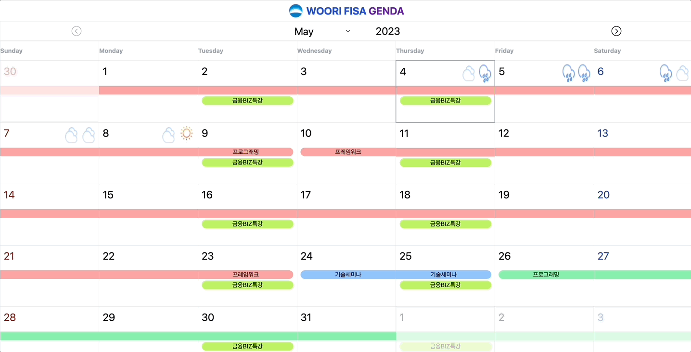

# 2th-FISAgenda

|김민준|정민성|한윤서|공태식|
|:--|:--|:--|:--|
|||||

## 프로젝트

### 주제

우리 FISA 커리큘럼을 달력에 한눈에 보여주기 위한 프로젝트

09:00 / 18:00 기준의 날씨도 함께 보여줌으로써 상쾌한 출퇴근 가능.

### 기술 스택

## 회고
### 김민준

#### 트러블 슈팅

Table의 tr 높이가 같게 조절이 되지 않는 문제
- flex 설정 -> x
- 퍼센트로 높이 조절 -> x
- height를 auto로 설정 -> 해결

 달력을 기존에 하드코딩으로 작성
 - javascript를 이용하여 각 달의 시작일 / 마지막일 기준 달력 생성

 CORS 문제
 - express의 cors 설정을 이용하여 front / back 서버가 달라도 API 호출 허용

#### 회고

Keep
- 라벨 2개 이상 정상 출력
- 오늘 날짜 표시
- 날씨 정보 출력
- tailwind css 사용

Problem
- 공휴일 정보를 불러와서 달력에 출력되면 좋겠음
- 아젠다 수정 / 삭제 / 추가 기능이 없음
- 라벨에 대한 추가 정보 필요
- JSDoc 적용 못함
- Dark Mode 적용 못함

Try
- 공휴일 API를 이용하여 대한민국 공휴일 표시
- Backend 구성하여 CRUD 기능 추가
- 라벨별로 카테고리를 추가하여 더 세세하게 분류
- 배포 후 유지보수
- JSDoc을 이용하여 문서화
- Dark Mode 적용

### 정민성

#### 트러블 슈팅
-파이어베이스 문제
  - 문제 : 파이어베이스의 버전이 올라가면서 문법이 변경되어 구글링을 해봐도 다 옛날 문법에 대한 포스팅만 있었음
  - 해결 : 파이어베이스의 공식 문서를 참고하여 베이스 코드를 작성함, 추가적인 부분은 파이어베이스 v9 ~~~ 이렇게 검색하니 찾을 수 있었음
- Promise 객체 관련 merge 문제
  - 문제 : merge할 때 Promise 객체를 기준으로 쓰여진 코드와 Array 객체를 기준으로 쓰여진 코드에서 오류가 발생함
  - 해결 : Promise 객체와 관련된 함수에 async와 await를 붙여주면서 해결함

#### 회고
- Keep
  - 아이디어가 좋아서 실제로 배포를 하여 유지보수하며 사용하고 싶음
  - 로컬 스토리지가 아닌 외부 데이터베이스를 사용함으로써 서비스의 확장성을 높임
  - Github의 issue와 Pull Request 기능을 사용함으로써 리포지토리와 코드 관리에 용이함을 느낌
- Problem
  - Promise 객체에 대한 이해도가 낮아 오류를 고칠 때 힘들었음
  - 개인적으로 서비스를 사용할 때 스케줄을 추가, 삭제, 수정할 수 있는 기능이 들어가 있지 않음
- Try
  - Promise 객체에 대해 공부가 필요함
  - 추가, 삭제할 수 있는 이벤트를 추가하여 현재 서버 코드와 연동시키면 가능함

### 한윤서

#### 트러블 슈팅
- label 문제
  - 문제 : label의 처음날짜와 마지막날짜만 가지고있어 그 중간 날짜를 확인하는 방법에 대해 고민이 있었음
  - 해결 : javascript의 Date 객체는 비교연산자가 가능하다는 것을 알게되어 원하는 날짜가 어떤 label을 포함하고 있는지 쉽게 구할 수 있었음
 
#### 회고
- Keep
  - github의 이슈를 pr에 명시함으로써 어떤 pr인지 좀 더 명확하게 확인가능해지고 관리가 용이해짐
  - figma를 이용해 웹페이지에 있는 요소들을 미리 정함으로 페이지를 구성하는 것에 시간을 덜 들일 수 있어 좋았음
- Problem
  - 코드 스타일을 정하지 않고 작성해 파일마다 코드에 일관성이 떨어짐
  - 테스트작업을 거치지 않아 기능을 완성하고도 자잘한 오류들을 자주 발견함
- Try
  - 코드 스타일을 정해 파일마다 코드의 일관성을 지킴
  - 테스트작업을 거쳐 오류를 최소화
  - 특정 날짜만 보여주는게 아니라 모든 날짜를 보여줄 수 있도록 

### 공태식

#### 트러블 슈팅
- 달력에 라벨을 표시하는데에 있어서 어려움이 있었습니다. 해당 라벨이 표시되어야하는 날짜를 어떻게 찾을지 몰랐습니다. 하지만 Date 객체를 이용하여 해결할 수 있었습니다. Date 객체도 비교 연산이 가능한 것을 알게되어 라벨 데이터에 시작 날짜와 끝 날짜를 데이터로 만들어 놓고 해당 날짜가 그 사이에 있는지 비교연산으로 체크할 수 있었습니다.
#### 회고
Keep
- 필요했던 부분을 구현한 것 같아서 좋았습니다. 커리큘럼을 받긴 받았지만 전달 받은 형식은 한눈에 보기 어려웠습니다. 달력으로 커리큘럼을 확인하니 눈에 잘 들어오는 것 같아서 좋습니다. 그리고 디자인도 잘 만든거 같아서 뿌듯합니다.

Problem
- 현재는 라벨을 추가하기 위해서는 코드를 수정해서 추가해야합니다. 커리큘럼에 대한 변경사항이 있을 경우 변경할 수 없다는 부분이 아쉽습니다. 그리고 JSDoc를 못해서 아쉽습니다.

Try
- 다음에는 라벨을 추가/수정/삭제도 가능하도록 구현하면 사용성이 더 좋아질 것 같습니다. 또한, 공휴일을 가져올 수 있는 API를 이용하여 공휴일도 표시될 수 있도록 수정하고 싶습니다.
